#### 启动步骤

1. 创建数据库(数据库信息见 `/src/main/resources/application.yml`),可根据自己需要修改

2. 启动 
```
 在项目跟目录下执行： ./gradlew bootRun
```

3. 打开浏览器，输入 `http://localhost:8080/`,看到页面显示 `Success!` ,环境搭建成功

### 结果截图：
#### Company API  
GET       /companies    #获取company列表  
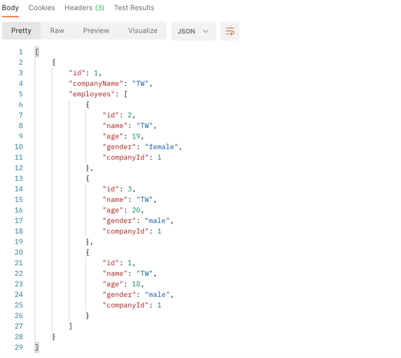   
GET       /companies/1  #获取某个具体company  
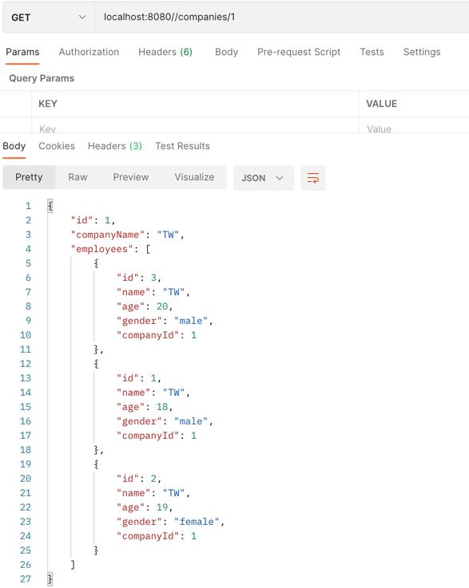  
GET       /companies/1/employees  #获取某个具体company下所有employee列表  
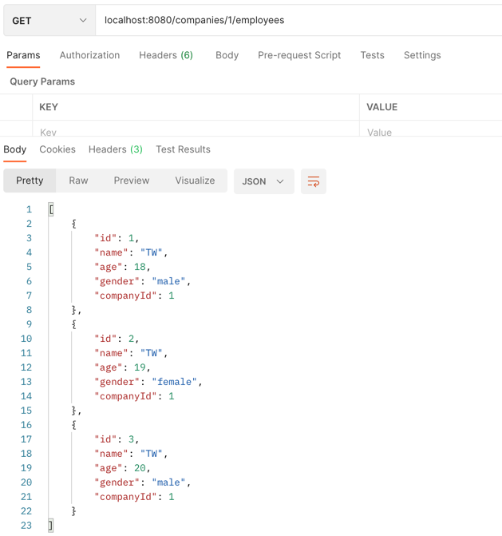  
GET       /companies/page/1/pageSize/5  #分页查询，page等于1，pageSize等于5    
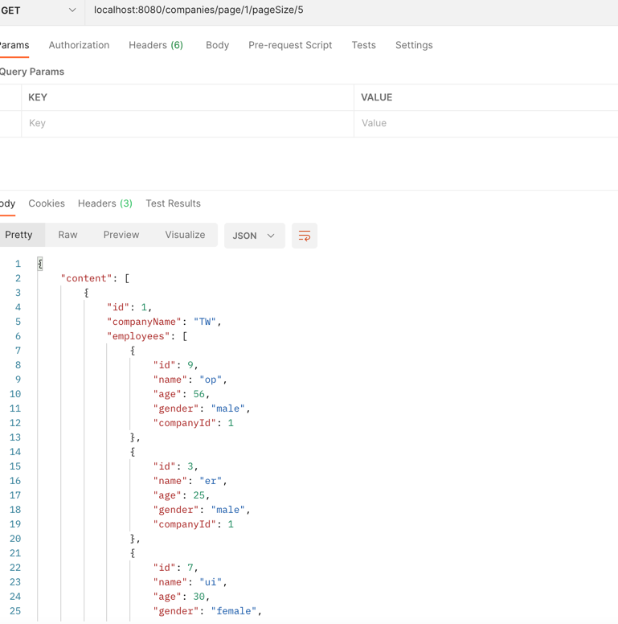  
POST      /companies    #增加一个company  
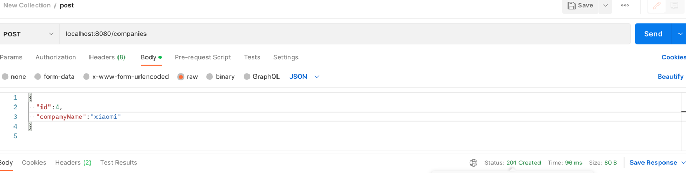  
PUT       /companies/1  #更新某个company  
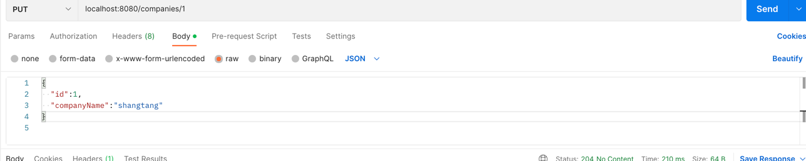  
DELETE    /companies/1  #删除某个company以及名下所有employees  
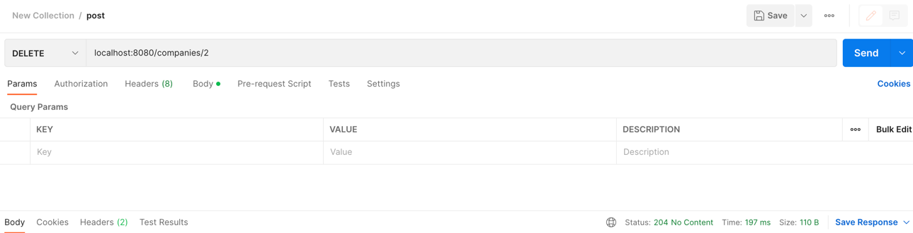  
#### employees API  
GET       /employees    #获取employee列表  
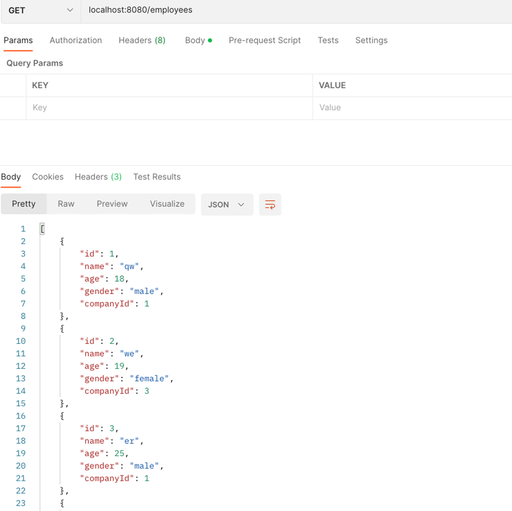  
GET       /employees/1  #获取某个具体employee  

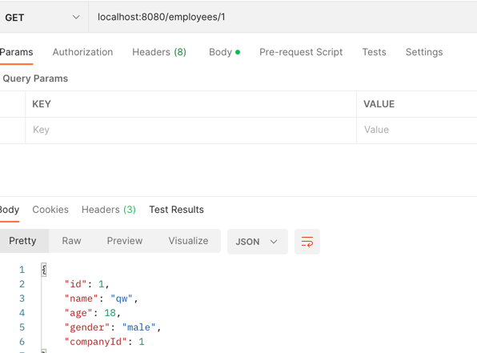  
GET       /employees/page/1/pageSize/5  #分页查询，page等于1，pageSize等于5  

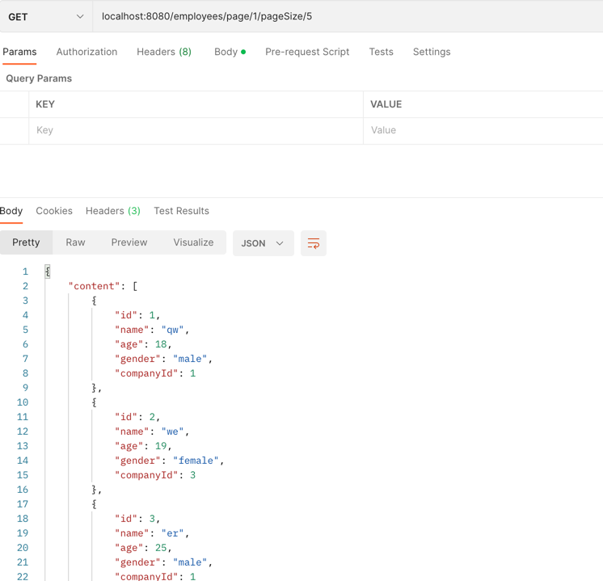  
GET       /employees/male   #筛选出所有男性Employee  

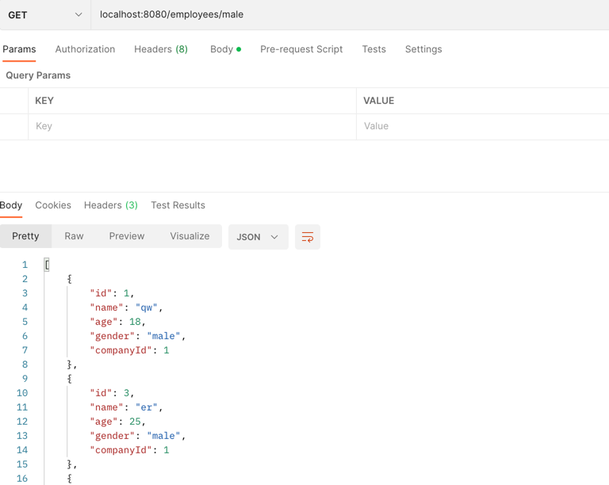  
POST      /employees    #增加一个employee  


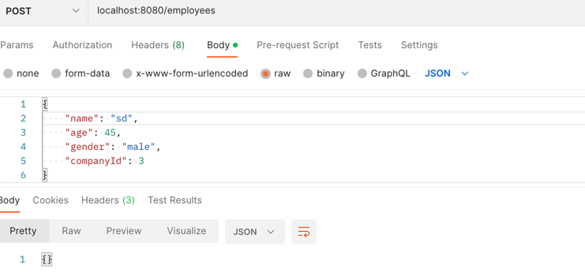  
PUT       /employees/1  #更新某个employee    

修改前  
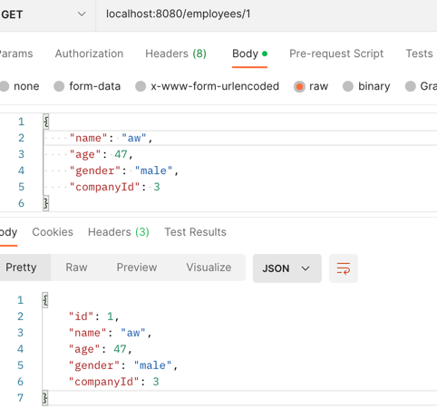  

修改  
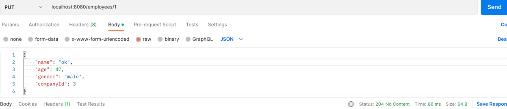  
修改后    
  
DELETE    /employees/1  #删除某个employee  
删除前  
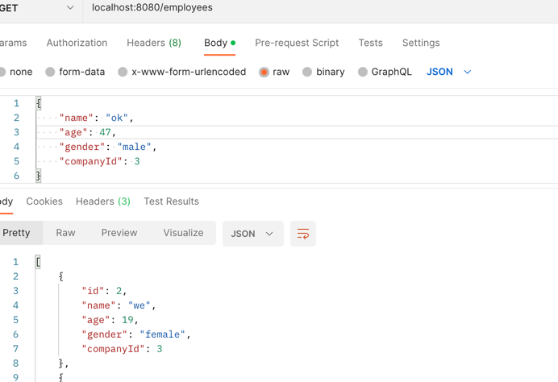  
删除操作  
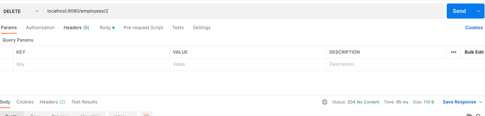  
删除后  
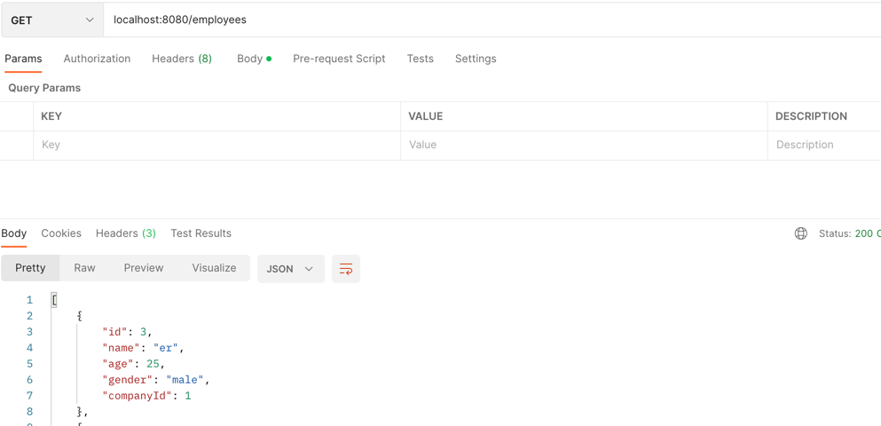  
